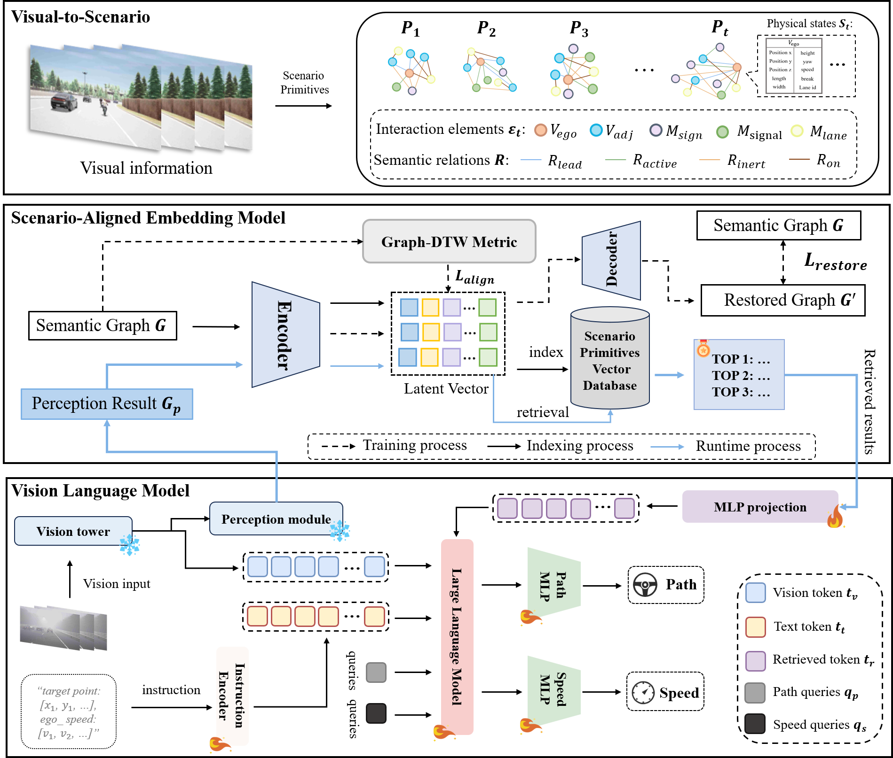

# VLADriver-RAG: Retrieval-Augmented Vision-Language-Action Models for Autonomous Driving

  <b>VLADriver-RAG</b> is a retrieval-augmented Vision-Language-Action framework for autonomous driving, designed to enhance planning robustness through structure-aware historical scenario retrieval.

  <a href="#">arXiv</a> •
  <a href="#">Model</a> •
  <a href="#">Dataset</a> •
  <a href="#">Checkpoint</a>

  

## News

- **[2026/xx/xx]** 🌐 Project page is live: [demo](#).
- **[2026/xx/xx]** 🚀 Released VLADriver-RAG Bench2Drive weights and inference code.
- **[2026/xx/xx]** 👉 We released our paper on [arXiv](#).
- **[2026/xx/xx]** 🎉🎉🎉 Accepted by IEEE Transactions on Industrial Informatics.

---

## Visualization

  

---

## Setup

<!-- TODO: Add environment setup and installation instructions here. -->
 

 Coming soon
 

---

## Datasets Download

<!-- TODO: Add dataset download and preparation instructions here. -->
 

 Coming soon
 

---

## Training

<!-- TODO: Add training instructions here. -->
 

 Coming soon
 

---

## Evaluation

<!-- TODO: Add evaluation instructions here. -->
 

 Coming soon
 

---

## Citation

<!-- TODO: Add BibTeX citation here. -->
